# Đây là chiếc điện thoại cao cấp nhất của Meizu.
Smartphone Meizu Pro 5 đã vừa chính thức ra mắt với tư cách là chiếc điện thoại đắt nhất và mạnh nhất tính tới thời điểm hiện tại của Meizu. Máy sở hữu thiết kế kim loại nguyên khối bóng bẩy với các góc bo tròn, viền kim loại sáng bóng và dễ khiến chúng ta liên tưởng tới iPhone của Apple.

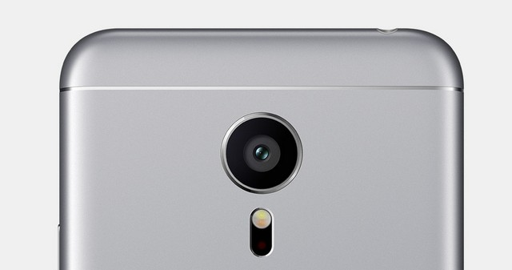

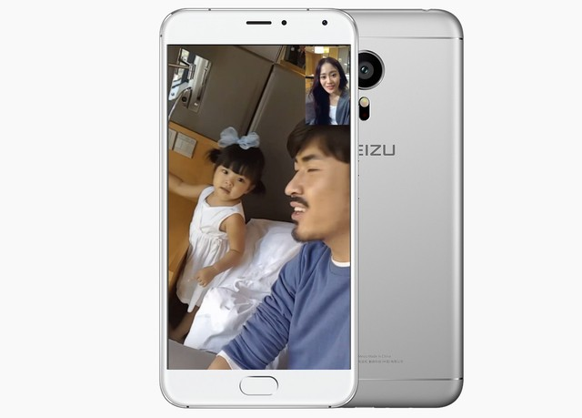

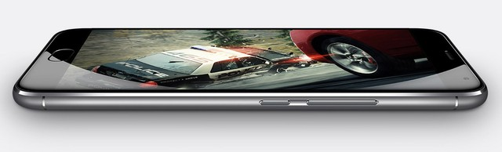

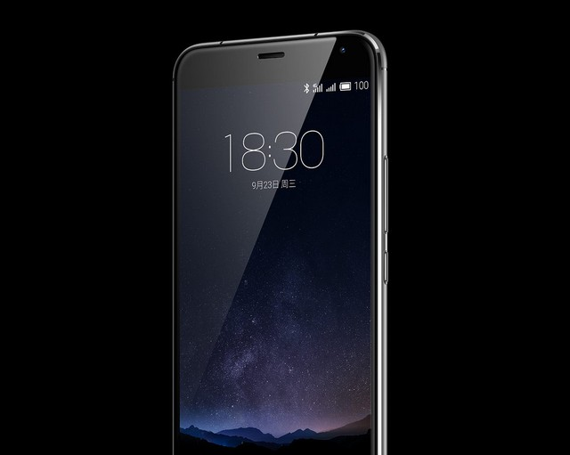

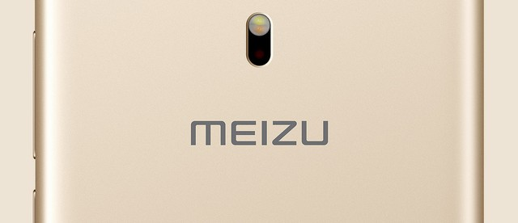

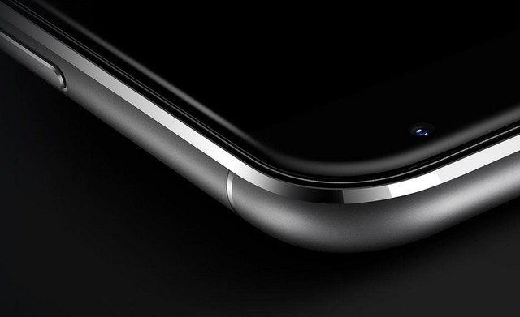

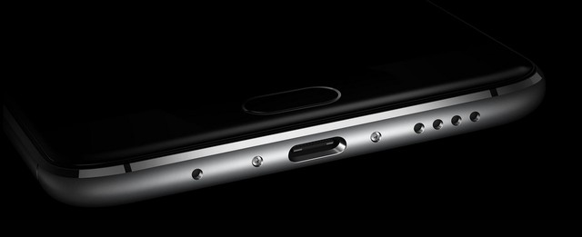

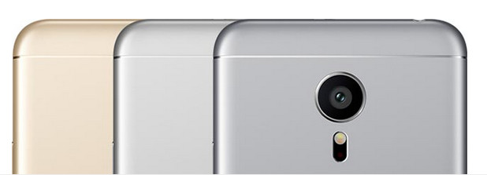

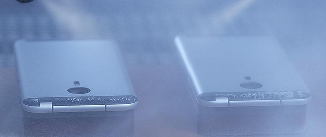

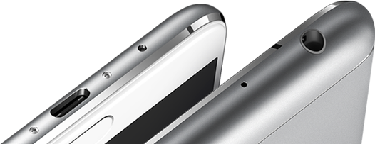

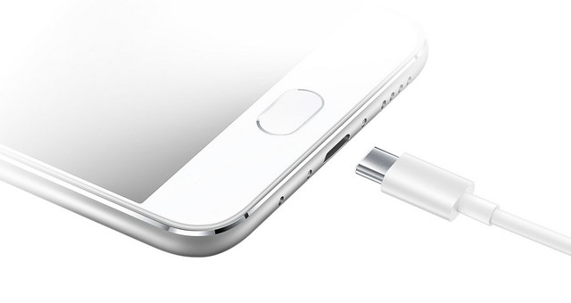

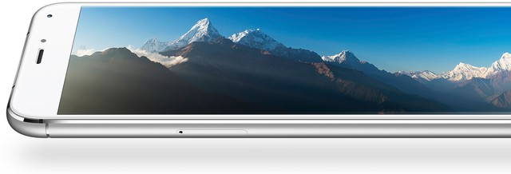

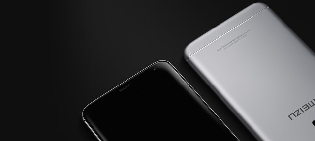

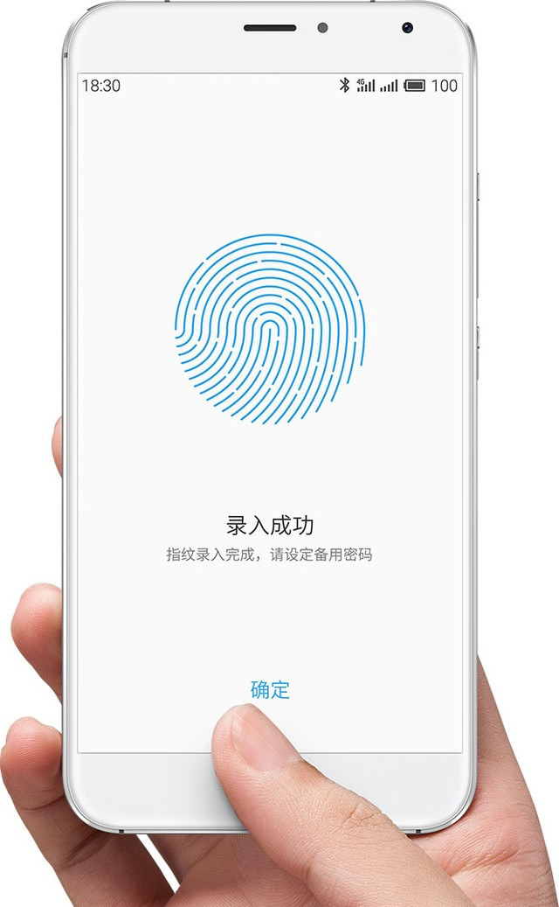

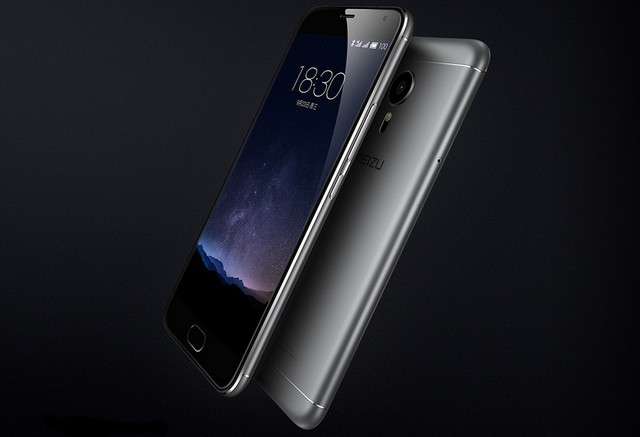

Meizu Pro 5 cũng hỗ trợ cảm biến vân tay, tính năng bảo mật cao cấp trên smartphone hiện nay. Ngoài ra, Meizu Pro 5 còn hỗ trợ USB Type C, chuẩn kết nối tiên tiến hiện nay cùng khả năng sạc nhanh cho phép tăng dung lượng pin lên 65% trong vòng 30 phút.

Chiếc điện thoại mới nhất của Meizu sở hữu vi xử lý Exynos 7420 của Samsung. Con chip này là một trong những thế hệ chip di động mạnh nhất trong năm nay và đang được sử dụng trên 2 flagship của Samsung là Galaxy S6 và Galaxy Note 5, màn hình 5,7 inch độ phân giải Full HD và 2 tùy chọn bộ nhớ RAM 3 GB hoặc 4 GB. Camera sau của máy đạt độ phân giải 21 megapixel trong khi camera trước hỗ trợ chụp ảnh ở độ phân giải 5 megapixel.

Meizu Pro 5 sẽ được bán từ ngày 12/10 với giá khoảng 439 USD cho bản 32 GB và 486 USD cho bản 64 GB.    